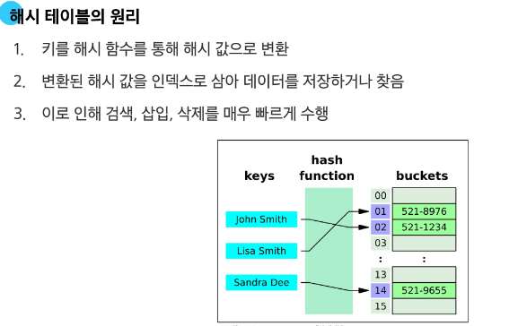
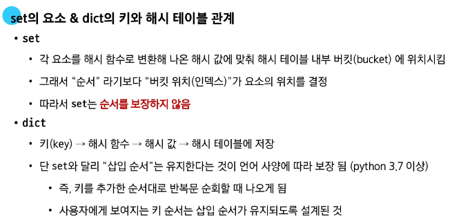

# TIL
--- 

> **Python - Basic syntax 1** 

평가 : 표현식을 계산하여 그 결과인 '값'을 만들어내는 과정
값이 안남으면 표현식이 아니라 문장

변수 : 값을 나중에 다시 사용하기 위해, 그 값에 붙여주는 고유한 이름 / 특정 객체를 가리키는 이름표

변수 할당 : 표현식이 만들어 낸 값에 이름을 붙이는 과정

재할당 : 만약 변수명이 이전에 다른 객체를 가리키고 있었다면, 그 연결은 끊어지고 새로운 객체와의 연결만 남음

타입 : 변수나 값이 가질 수 있는 데이터의 종류
타입은 '값'과 '연산자'로 구분한다.

메모리의 모든 위치에는 그 위치를 고유하게 식별하는 메모리 주소가 존재
값+타입+메모리 주소 정보를 묶은 것을 객체라고 부름

Numeric types
    - int, float, complex

Text types
    - str
    문자들의 순서가 있는 **변경 불가능**한 **시퀀스** 자료형

Squence types
    - str, list, tuple, range
    여러 데이터가 순서대로 일렬로 늘어선 자료구조
    정렬이 아님
    인덱스 : 값 위치 고유 번호 0번부터~ 
    * 음수 인덱스도 지원 ! 마지막 값은 -1
    my_sequence[start : stop(포함x) : step(간격)]
    거꾸로 [::-1]
    슬라이싱
    길이 len() 구하기 가능
    반복문
    

Non-sequence types
    - set, dict

기타
    - Boolean, None, Function

> **Python - Version control1**

CLI
: Command Line Interface

Git
: 분산 버전 관리 시스템
 - Working Directory, Staging Area, Repository
> 

## 260126
--
Data Structure 
--
# ws_5_a.py 

```python
N = 9
data_1 = '123456789'
arr_1 = []
# 아래에 코드를 작성하시오.

for num in data_1:
    arr_1.append(num)
# N번만큼 반복하라는 말에 속지 마라...

M = 15
data_2 = '1 2 3 4 5 6 7 8 9 10 11 12 13 14 15'
# 아래에 코드를 작성하시오.

# 위는 되는데, 아래 코드는 안 되는 이유

M = 15
data_2 = '1 2 3 4 5 6 7 8 9 10 11 12 13 14 15'
arr_2 = []

for m in data_2:
    arr_2.split(' ')

print(arr_2)

# split()은 리스트가 아니라 문자열에 쓰는 도구이다. arr_2에 사용할 수 없다. 
# data_2에 for문을 돌리면, 공백까지도 하나하나 다 가져온다. 숫자 10도 1과 0으로 쪼개진다.
# data_2 문자열을 공백 기준으로 잘라서 바로 리스트로 만든다.
arr_2 = data_2.split(' ') 
# ['1', '2', '3', '4', '5', '6', '7', '8', '9', '10', '11', '12', '13', '14', '15']

# 문자열이 아닌 정수로 변환해서 리스트에 담는 방법

arr_2 = []
for m in data_2.split():
    arr_2.append(int(m))

# 위의 코드를 list comparison으로 하는 방법
arr_2 = [int(num) for num in data_2.split(' ')]

# arr_2가 가진 요소들을 순회하며 홀수만 차례대로 출력하는 방법

arr_2 = []
for num in data_2.split():
    value = int(num) # 일단 숫자로 바꾸고
    if value % 2 != 0: # 2로 나눴을 때 나머지가 있으면(홀수면)
        arr_2.append(value)

print(arr_2)
# [1, 3, 5, 7, 9, 11, 13, 15]

# 위의 코드를 list comparison으로 하는 방법
arr_2 = [int(num) for num in data_2.split() if int(num) % 2 != 0]

# 인덱스를 이용한 방법

# 전체 리스트를 먼저 만든 뒤
full_list = [int(num) for num in data_2.split()]

# 0번 인덱스부터 끝까지, 2칸씩 건너뛰며 가져오기 (1, 3, 5...)
odd_list = full_list[::2]

print(odd_list)

# 정확한 출력값 최종 답안

M = 15
data_2 = '1 2 3 4 5 6 7 8 9 10 11 12 13 14 15'

# 리스트로 먼저 정리 (공백 제거 및 정수 변환)
numbers = [int(num) for num in data_2.split()]

# 하나씩 꺼내서 홀수인지 확인하고 출력
for n in numbers:
    if n % 2 != 0:
        print(n)

```
# 

```python

def count_character(text, t):
    return text.count(str(t))

result = count_character("Hello, World!", "o")
print(result)  # 2

## 알고리즘 연습 ##
def count_character(text, t):
    count = 0
    target = str(t)
    
    # 문자열을 하나씩 검사하면서 target과 같으면 숫자를 올립니다.
    for char in text:
        if char == target:
            count += 1
            
    return count

result = count_character("Hello, World!", "o")
print(result)  # 2

## list comparison 활용 ##
def count_character(text, t):
    # 일치하는 문자들만 모아서 리스트를 만들고, 그 길이를 잽니다.
    return len([char for char in text if char == str(t)])

result = count_character("Hello, World!", "o")
print(result)  # 2

```

# hw_5_4.py

```python

# 아래 함수가 오류가 난 이유는, 리스트는 함수가 아닌데 함수처럼 my_list()로 쓰려고 했기 때문이다.
# 리스트는 객체이다.
# min과 max는 내장 함수이다. 리스트 안에 인자로 넣는 것이 아니라, min(리스트) 형태로 리스트를 함수에 넣어야 한다.
def find_min_max(my_list):
    
    return (my_list(min), my_list(max))

# 수정 결과
def find_min_max(my_list):
    
    return (min(my_list), max(my_list))


result = find_min_max([3, 1, 7, 2, 5])
print(result)  # (1, 7)

```

# ws_5_1.py
## 문자열 역순 반환

```python

# 1. 슬라이싱 활용

text = "Python"
# [시작:끝:간격]인데 간격을 -1로 주면 뒤에서부터 읽습니다.
reversed_text = text[::-1]

print(reversed_text) # "nohtyP"

# 2. Built in-Function 활용

def reverse_string(text):
    return "".join(reversed(text))

result = reverse_string("Hello, World!")
print(result)  # !dlroW ,olleH

# list()를 안 써도 된다. 
# "" 빈 문자열 : 글자들 사이 아무런 간격 없이 붙이고 싶을 때 사용한다.
```

# ws_5_b

```python

data_1 = 'qweqwYadnOyjnsaU4trwg asjnaAn245krRmkfE 42grTasdnHasdnvEasdn asdevadnBasdanEsdkqefqefvaSasdqaeeqqvedwt5hfbsdT24tewfd'

# data_1를 순화하며 대문자이거나 공백 ' '인 경우만 출력한다.
# print시, 줄바꿈을 없애고 싶다면 , end= ' '
for a in data_1 :
    if a.isupper() or a ==' ':
        print(a, end='')
# YOU ARE THE BEST

# data_2에서 문자열 '내힘들다'의 각 글자들이 위치한 index 번호를 find 메서드를 활용해 찾는다.
data_2 = '걉파반샤팝다푸거맥파바자들퍼바배들밥샵파누타히매니배사바파힘다브사부힙헤베내테치대내'
arr = []

for nhdd in data_2:
    nhdd = ['내', '힘', '들', '다']
    return data_2.find(nhdd)

# 위의 코드가 오류인 이유
# return 결과 반환 후 즉시 종료
# nhdd 변수를 재정의해버린다.
# find() 함수는 인자로 문자열을 받아야 한다. 리스트를 넣으면 찾을 수 없다.


print(data_2.find('내힘들다'))

# 위의 코드가 안 되는 이유 # -1 (찾을 수 없음)
# find() 함수는 괄호 안에 넣은 문자열이 통째로, 순서대로 붙어 있는 곳을 찾기 때문이다. 

# 아래와 같이 하나씩 물어봐서 arr 리스트에 담는다. 

for char in '내힘들다':
    arr.append(data_2.find(char))
print(arr)

# sort 메서드를 활용해 arr 리스트를 오름차순 정렬한다.
arr.sort()
# sort()는 None을 반환한다. print(arr.sort()) 할 시에, 출력은 None
# 다시 프린트하여 확인할 수 있다.
print(arr)

# data_2에서 정렬된 arr을 순회하여 얻은 각 요소 번째에 위치한 문자열을 출력한다.

for n in arr:
    print(arr[n])

# 위 코드가 오류인 이유 
# 해당 인덱스 번호 값을 찾는 곳이 arr가 아니라 data_2이어야 한다.

for n in arr:
    print(data_2[n], end = '')

# 다들힘내

```

# ws_5_2.py

```python

# 주어진 리스트에서 중복된 요소를 제거한 새로운 리스트를 반환하는 remove_duplicates 함수를 작성한다.
# 리스트를 인자로 받아 중복이 제거된 새로운 리스트를 반환한다.

# 1. set 활용법

def remove_duplicates(a):
    new_lst = []
    a = list(set(a))
    return a

result = remove_duplicates([1, 2, 2, 3, 4, 4, 5])
print(result)

# 2. for 문과 not in 키워드 활용

def remove_duplicates(a):
    new_lst = []
    for item in a:
        # 만약 new_lst에 현재 아이템이 없다면 (중복이 아니라면)
        if item not in new_lst:
            new_lst.append(item) # 추가한다
    return new_lst

result = remove_duplicates([1, 2, 2, 3, 4, 4, 5])
print(result) # [1, 2, 3, 4, 5]
```

# ws_5_c.py

```python
# 문자열과 리스트가 가진 메서드
# 잘못된 문장이 작성된 문자열 original_word, 제거할 대상이 작성된 word 문자열과 빈 리스트 arr이 주어진다.

original_word = '코딩 공부는ㄴ 1일ㄹ 1커ㅓ밋ㅅ @@@#^()#_+!&~:"'
word = '1ㄴ2ㄹ3ㅓ4ㅅ5'
arr = []

# 1.list() 함수가 한 글자씩 다 쪼개서 리스트로 만들어줍니다.
arr = list(original_word)

# 2.extned 함수를 활용하는 방법 - extend는 문자열을 한 글자씩 분해해서 arr에 이어 붙입니다.
# 문자열은 한 글자씩 꺼낼 수 있는 반복 가능한 객체이기 때문에 extned 함수를 쓸 경우, 리스트에 다른 리스트를 넣을 때와 똑같은 논리로 작동한다.
arr.extend(original_word)

# 리스트	arr.extend([1, 2])	1, 2를 하나씩 꺼내서 추가
# 문자열	arr.extend("AB")	'A', 'B'를 하나씩 꺼내서 추가
# 튜플	arr.extend((3, 4))	3, 4를 하나씩 꺼내서 추가
```
```python
# append() vs extend() 차이점:  
# 이 두 함수의 차이를 명확히 아는 것이 중요합니다.  
append(original_word): # 문자열 통째로를 리스트의 한 칸에 집어넣습니다.  
# ['코딩 공부는ㄴ ...'] (길이 1)

extend(original_word): # 문자열을 낱개로 쪼개서 리스트의 여러 칸으로 이어 붙입니다.
# ['코', '딩', ' ', '공', '부', ...] (길이 43)
```
```python
# 문자열과 리스트가 가진 메서드
# 잘못된 문장이 작성된 문자열 original_word, 제거할 대상이 작성된 word 문자열과 빈 리스트 arr이 주어진다.

original_word = '코딩 공부는ㄴ 1일ㄹ 1커ㅓ밋ㅅ @@@#^()#_+!&~:"'
word = '1ㄴ2ㄹ3ㅓ4ㅅ5'
arr = []

# original_word 변수에 담긴 각 문자열을 모두 나누어 arr 리스트에 담는다.
arr.extend(original_word)
print(arr)

# 문장에서 잘못된 내용을 제거하는 함수 resructure_word 함수를 작성한다.

def restructure_word(word, arr):
    # 인자로 넘겨받은 word 문자열을 순회한다.
    for n in word:
        # 만약 순회중인 문자열이 숫자라면, 해당 숫자 만큼 반복하여 arr의 마지막 요소를 제거한다.
        if n.isdecimal():
            # int(w)만큼 반복해서 pop() 실행
            for _ in range(int(n)):
                if arr: # 리스트가 비어있지 않을 대만 삭제
                    arr.pop()
        # 그 외의 경우, arr에서 해당 문자열을 제거한다.
        else:
            if n in arr: # 리스트에 해당 글자가 있을 때만 삭제
                arr.remove(n)
    # 불필요한 문자를 제거한 arr를 반환한다.
    return arr 
# 함수 호출 결과를 result에 담고 result를 출력한다.

# result에 할당된 리스트를 하나의 문자열로 변환하여 출력한다.
result = restructure_word(word, arr)
print(result)
** print(result.join(arr))
# result.join(arr) -> .join()은 리스트가 아니라 문자열이 가지고 있는 기능이다.

result = restructure_word(word, arr)
print(result)
print("".join(result))
```

# ws_5_3.py

```python

# 주어진 튜플을 정렬하여 새로운 튜플로 반환하는 sort_tuple 함수를 작성하시오.
# 튜플을 인자로 받아 정렬된 새로운 튜플을 반환해야 한다.
# 튜플은 리스트와 달리 내부 값을 변경할 수 없는 성질을 가지고 있다. 그래서 튜플을 직접 정렬하는 메서드는 없으며, 정렬된 새로운 리스트를 만든 뒤 다시 튜플로 변환하는 과정을 거쳐야 한다.

def sort_tuple(t):
    # sorted() 함수는 어떤 반복 가능한 객체든 '정렬된 리스트'로 반환한다.
    # 결과가 리스트이므로, 다시 tuple()로 형변환을 해준다.
    new_tuple = tuple(sorted(t))
    return new_tuple

result = sort_tuple((5, 2, 8, 1, 3))
print(result)

## 이렇게 줄이기도 가능하다.
def sort_tuple(t):
    return tuple(sorted(t))
```

# ws_5_4.py

```python

# return 뒤에 아무것도 없으면 None 값을 반환한다.
def capitalize_words(text):
    text.title()
    return


result = capitalize_words("hello, world!")
print(result)

# 최종 제출

def capitalize_words(text):
    return text.title()

result = capitalize_words("hello, world!")
print(result)
```

## 260127

--
Data structure 2
--

1. Dictionary  
키와 값을 짝지어 저장하는 자료구조
    - 내부적으로 해시 테이블을 사용하여 키-값 쌍을 관리한다.
    - 키를 통한 값의 삽입, 삭제, 검색이 데이터의 크기와 관계업싱 매우 빠르다.
    - 키는 hashable한 고유 값이어야 하지만, 값은 중복이 가능하고 어떤 자료형도 저장 가능하다.

- 딕셔너리 메서드 
> **.get(key[, default])**  
key 연결된 값을 반환하거나, 키가 없을 경우 None 혹은 기본 값을 반환  
print(person['country']) -> key가 있을 때는 반환값이 같지만, 키가 없을 경우  # KeyError: 'country' 

> **.keys()**  
딕셔너리 키를 모은 객체를 반환  
덩어리가 나옴. map, range, zip 등...  
덩어리로 만들어 두는 이유는
평가를 나중에 하고 싶을 때, 활용하고 싶을 때 쓰고 싶으므로. 일단 키는 추출해놓고 나중에 진행하겠다.

> **.values()**  
딕셔너리 값을 모은 객체를 반환  
덩어리. 마찬가지로 추후 평가 진행.

> **.items()**  
딕셔너리 키/값 쌍을 모은 객체를 반환

> **.pop(key[, default])**  
키를 제거하고 연결됐던 값을 반환 (없으면 에러나 default를 반환)

> **.clear()**  
빈 딕셔너리로 만들기

> **.setdefault(key[,defualt])**  
키와 연결된 값을 반환 (.get()의 조회기능)  
키가 없다면 default와 연결한 키를 딕셔너리에 추가하고 default를 반환

> **.update([other])**  
other가 제공하는 키/값 쌍으로 딕셔너리를 갱신하고 기존 키는 덮어씀  
(* other는 딕셔너리에 추가하거나 갱신할 키-값 쌍을 가진 다른 데이터 객채를 의미하는 자리 표시자이다.)

2. set  
고유한 항목들의 정렬되지 않은 컬렉션 (중복 불가, 순서 없음)
- 딕셔너리처럼 내부적으로 해시 테이블을 사용하여 데이터를 저장한다.
- 딕셔너리와 세트는 비시퀀스 데이터라 순서가 없다. 이것이 해시 테이블과 연관?
- 이로 인해 항목의 고유성 보장, 항목의 추가, 삭제, 존대 여부 확인이 매우 빠르다.
- 수학적인 집합 연산 간편하게 수행 가능하다.
- 딕셔너리와는 다르게 출력 시 순서가 매번 다르게 나온다.


> **.add(x)**  
세트에 x를 추가  

> **.update(iterable)**  
세트에 다른 iterable 요소를 추가  
반복가능한 인자만 받는다. 중복 불가.

> **.clear()**  
빈 세트 만들기  
set()

> **.remove(x)**  
세트에서 항목 x를 제거, 항목 x가 없을 경우 keyError

> **.pop()**  
세트에서 임의의 요소를 제거하고 반환  
리스트의 경우 마지막을 제거하거나 인덱스를 주어 그것을 제거한다.  
딕셔너리의 경우 키를 줘서 제거한다.  
그러나, 세트에서는 순서가 없고 키가 없으므로 임의의 요소를 제거한다.  
.pop()은 언제나 무언가를 제거 후 반환한다.

> **.discard()**  
세트 s에서 항목 x를 제거한다.  
.remove()와 달리 에러 없음.  
없는 키를 넣을 경우, 아무 것도 출력되지 않는다.

- 세트의 집합 메서드  
순서 상관없는 중복이 없는 요소의 종류를 다룰 때 가끔 쓰인다.

> set.differnce(set2)  
> set1.intersection(set2)  
> set1.issubset(set2)  
> set3.issubset(set1)  
> set1.issuperset(set2)  
> set1.union(set2)  

3. [참고] 딕셔너리의 확장 : defaultdict  
내장 모듈 collections에서 제공하는 딕셔너리 확장판
- 딕셔너리에 존재하지 않는 키를 조회할 때,  
자동으로 '기본값'을 생성함.   
- .setdefault()와 유사함. 호출 시마다 기본값을 넣어줄 수 있지만, defaultdict는 객첼를 생성할 때 한 번만 설정하면 되어서 반복문 안에서 깔끔.

> defaultdict(자료형)

    1. 숫자세기:defaultdict(int)
    - 키가 없으면 0으로 초기화
    2. 그룹핑/리스트 모으기:defaultdict(lsit)
    - 키가 없으면 빈 리스트로 초기화

- 99_dict_practice_01.py 여러 방법으로 풀어보기

- defaultdict는 조회만 해도 키가 생성됨.
단순히 키가 있는지 확인할 때는 get을 사용.

4. [참고] 파이썬의 문법 규격

- 문서적 표현들
- 파이썬 공식 문서의 '6.표현식'
- 확장 BNF 표기법 : backus-Naur Form - 프로그래밍 언어의 문법을 표현하기 위한 표기법

5. [참고] 해시 테이블

- 키와 값을 짝지어 저장하는 자료구조
- 
- 리스트는 처음부터 찾을 때까지 봐야하지만, key를 쓰는 자료구조는 해시 함수를 통해 딕셔너리의 크기에 상관없는 동일한 속도로 진행된다.

- 해시란?  
임의의 크기를 가진 데이터를 고정된 크기의 고유한 값으로 변환하는 것  
생성된 해시 값(정수)은 해당 데이터를 식별한 지문 역할  
파이썬은 이 해시 값을 이용해 해시 테이블에 데이터를 저장  
이 변환을 수행하는 것이 해시 함수! -> 임의 길이 데이터를 입력받아 고정길이(정수)로 변환해 주는 함수.
- 매우 빠른 검색 및 데이터 저장 위치 결정에 활용.
- 해시 알고리즘

- set의 요소 & dict의 키와 해시 테이블의 관계

- 해시 함수는 계속해서 refrash 한다.

- .pop() 했을 때, 높은 확률로 1이 나오는 이유?  
해시 함수를 거쳐서 버킷에 들어가게 된다. pop을 하게 되면, 버킷에 작성된 순서대로 나온다. 버킷에 있는 해시값이 주소이고, 정수 형태이다. 정수를 정수로 바꾸는 과정을 하고 싶지 않은 파이썬...정수라면 그대로 해시 값에 쓴다. 버킷에 배치된 순서대로 pop이 된다. 문자열은 해시 계산을 무조건 해야하므로, 해시 난수화가 적용된다. 실행마다 순서가 다르다.

- hashable  
대부분의 불변 타입은 해시 가능 (int, float, str, tuple...)  
가변형 객체(list, dict, set)는 해시 불가능 : 값이 변하면 해시 값도 달라질 수 있어 해시 테이블 무결성이 깨짐

- 해시 테이블은 해시 값을 인덱스로 삼아 데이터를 저장, 검색

----

# 문제 풀다가 배운 것들

1. 딕셔너리에 키, 값 쌍 추가 혹은 값 수정
```python

# 사물함 [칸 이름] = 채울 내용
# key가 해당 딕셔너리에 없을 때 -> 새로 추가

d = {'name': 'Gemini'}
d['country'] = 'USA'  # 'country'라는 칸이 없으므로 새로 만듦
# 결과: {'name': 'Gemini', 'country': 'USA'}

# key가 해당 딕셔너리에 있을 때 -> 덮어쓰기 (수정)

d = {'name': 'Gemini'}
d['name'] = 'Flash'   # 'name' 칸에 있던 'Gemini'를 빼고 'Flash'를 넣음
# 결과: {'name': 'Flash'}

# 반복문 내에서 작동

for key, value in kwargs.items():
    new_dict[key] = value

# 1. kwargs.items(): "이름표=선물" 뭉치에서 하나씩 꺼냅니다.
# 2. 첫 바퀴: key는 'country', value는 'USA'가 됩니다.
# 3. new_dict['country'] = 'USA': new_dict 사물함의 'country' 칸에 'USA'를 넣습니다.
# 4. 다음 바퀴: 새로운 키와 값을 가져와서 똑같이 사물함에 넣습니다.
```

- 딕셔너리에 키, 값 쌍으로 추가 -> 딕셔너리 메서드 .update() 사용하기

```python

def add_item_to_dict(target_dict, key, value):
    new_dict = target_dict.copy()
    
    # 딕셔너리 메서드 사용: {key: value} 형태의 딕셔너리를 합쳐버림
    new_dict.update({key: value})
    
    return new_dict

my_dict = {'name': 'Alice', 'age': 25}
result = add_item_to_dict(my_dict, 'country', 'USA')
print(result)
```