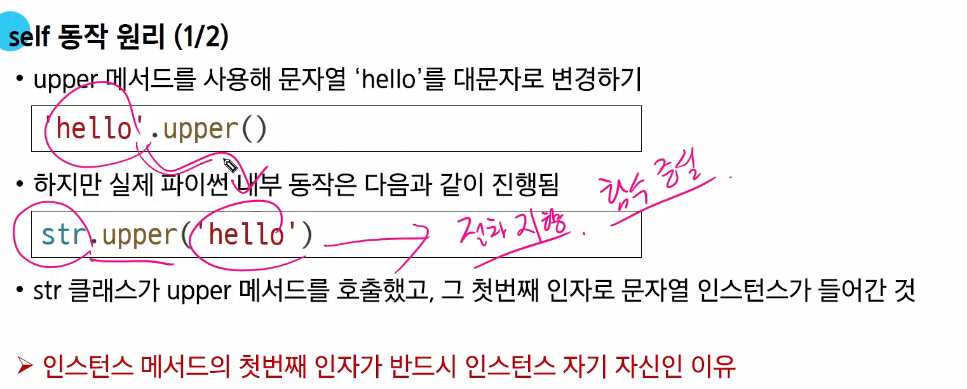
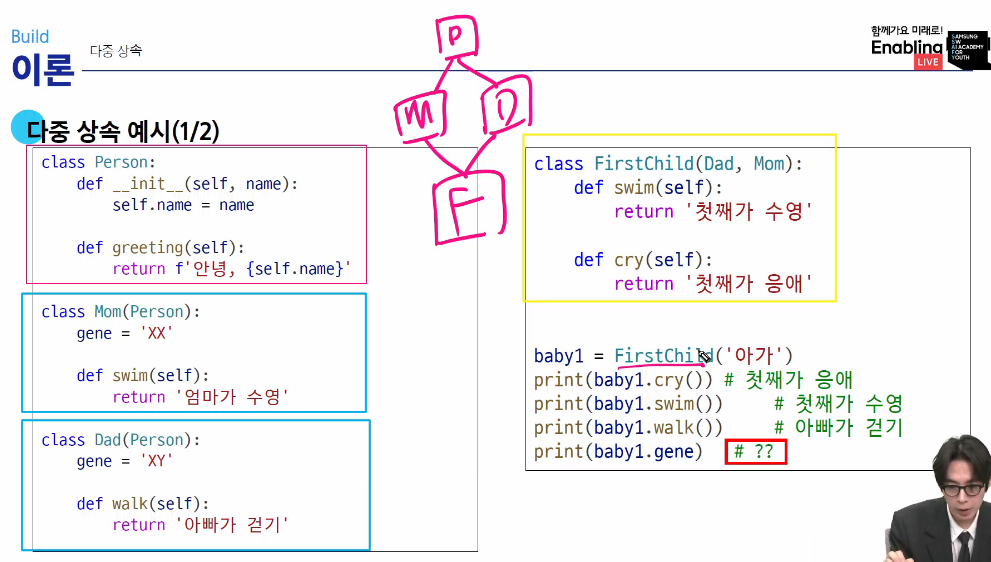
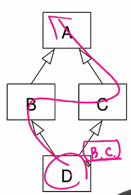
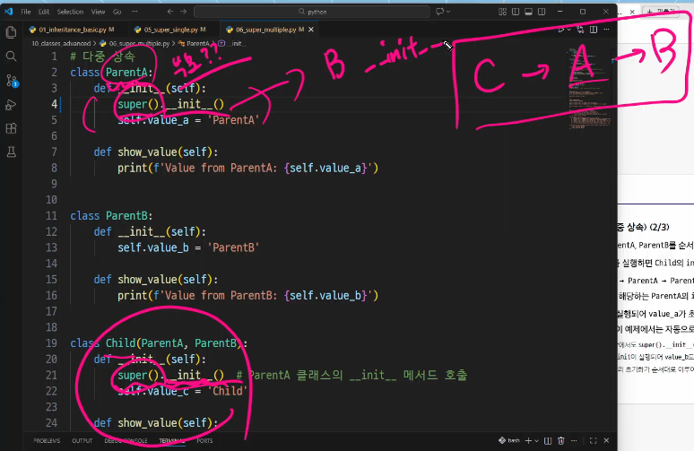

# TIL * limji02

## **Python - Basic syntax 1** 

**평가** : 표현식을 계산하여 그 결과인 '값'을 만들어내는 과정, 값이 안남으면 표현식이 아니라 문장

**변수** : 값을 나중에 다시 사용하기 위해, 그 값에 붙여주는 고유한 이름 / 특정 객체를 가리키는 이름표

**변수 할당** : 표현식이 만들어 낸 값에 이름을 붙이는 과정

**재할당** : 만약 변수명이 이전에 다른 객체를 가리키고 있었다면, 그 연결은 끊어지고 새로운 객체와의 연결만 남음

**타입** : 변수나 값이 가질 수 있는 데이터의 종류  
타입은 '값'과 '연산자'로 구분한다.

**메모리 주소** : 메모리의 모든 위치에는 그 위치를 고유하게 식별하는 메모리 주소가 존재  

**객체** : 값+타입+메모리 주소 정보를 묶은 것

**Numeric types** : int, float, complex

**Text types** : str  -> **변경 불가능**한 **시퀀스** 자료형

**Squence types** : str, list, tuple, range  
여러 데이터가 순서대로 일렬로 늘어선 자료구조 (정렬이 아님)  
**인덱스** : 값 위치 고유 번호 (0번 부터)  
음수 인덱스도 활용 -> 마지막 값은 [-1]  
```my_sequence[start : stop(포함x) : step(간격)]```  
거꾸로 [::-1]  
슬라이싱  
길이 len() 구하기 가능  
반복문
    

**Non-sequence types** : set, dict

**기타** : Boolean, None, Function

<br>

## **Python - Version control1**

CLI : Command Line Interface

Git : 분산 버전 관리 시스템  
Working Directory, Staging Area, Repository

<br>

## **Python - Basic Syntax2**

문자열, 튜플, range 불변성!   
리스트, 딕셔너리, 셋은 가변성!

**list**
- 여러 개의 값을 1.순서대로 저장하는, 2.변경 가능한(mutable) 시퀀스 자료형
- 중첩 리스트 접근
my_list = [ 1, 'a', 2, [1,2,'3']]
- 인덱싱, 슬라이싱, 길이

```python
my_list = [1, 2, 3, 4, 5]
# 인덱싱으로 값 수정 가능
my_list[1] = 'two' # [1, 'two', 3, 4, 5]
# 슬라이싱으로 여러 값 한번에 바꾸기
my_list[2:4] = ['three', 'four'] # [1, 2, 'three', 'four', 5]
```
<br>

**tuple**
- 여러 개의 값을 1.순서대로 저장하는, 2.변경 불가능한 시퀀스 자료형
- 리스트와 비슷하지만, 한번 만들어지면 절대 수정할 수 없다. 
my_tuple = (1,) *단일 요소 튜플을 만들 때는 반드시 후행 쉼표를 사용해야 한다.
- 인덱싱, 슬라이싱, 길이

- 튜플의 값 교환? 튜플의 패킹과 언패킹에 대해 이해하기

```python

x, y = 1, 2
# 내부 동작 : (1, 2)라는 튜플을 생성한다. 

x, y = y, x
# 우변을 좌변보다 먼저 처리한다.
# y, x를 먼저 일어 임시 튜플 (2, 1)을 만든다. -> 안전하다! 원래 변수 x, y와는 별개의 독립적인 메모리 공간에 존재하기 때문이다. 나중에 좌변의 x값이 바뀌더라도, 복사된 값은 영향 받지 않고 그대로 유지. 튜플같은 중간 매개체가 없다면, x를 바꾸는 순간 원래의 x값이 사라져 y에게 줄 값이 없어지게 된다.
# 우변 (2, 1)에서 값을 하나씩 꺼내 왼쪽 변수에 다시 할당한다.
# 2 -> x에게 새로부여, 1-> y에게 새로 부여

# 튜플이 수정된 것이 아니며, 변수 x와 y가 가리키는 대상(메모리 주소)이 바뀐 것이다. 
# 왜 안전한가? 오른쪽에서 복사본(튜플)을 미리 만들어두기 때문에, x에 값을 넣는 순간 원래 x값이 사라져도 상관없기 때문이다.
```

<br>

**range**
- 연속된 정수 시퀀스를 생성하는, 2.변경 불가능한 자료형
- 주로 반복문과 함께 사용, 특정 횟수만큼 코드 반복 실행   
```range(Start, stop, step)```   
*매개변수(인자)가 하나면 stop으로 인식한다.   
start는 0, step은 1 기본 설정.  
```range(5) #0,1,2,3,4  ```  
list()로 형변환시 내부 값 확인 가능!

<br>

**dict**
- 키, 값의 쌍으로 이루어진 1.순서와 중복이 없는 2.변경 가능한 자료형  
```my_dict = {'key':'value', 'apple':12}```  
- key는 중복될 수 없음, 변경 불가능한 자료형만 가능.(list,dict은 불가능함. tuple은 가능함.)  
```python
# 값 접근 방법  
my_dict['key'] #'value'
# 값 추가 및 변경
my_dict['new_key'] = 'new_value'
my_dict['key'] = 'value_2'
```

<br>

**set**
- 1.순서와 중복이 없는 2.변경 가능한 자료형
```python
my_set_1 = set()
my_set_2 = {1,2,3}
# 집합 활용 효과적
'''합집합 a|b
차집합 a-b
교집합 a&b '''
```

<br>

**None**  
값이 없음을 표현하는 데이터 타입

**Boolean**  
참과 거짓의 값만 가진 데이터 타입  

**collection**  
- 여러 개의 값을 하나로 묶어 관리하는 자료형을 통칭하는 말  
str, list, tuple, range, set, dict

| 자료형 | 변경 가능 (Mutable) | 순서 존재 (Ordered) | 특징 및 용도 |
| :--- | :---: | :---: | :--- |
| **문자열 (str)** | **X** | **O** | 텍스트 데이터, 튜플처럼 수정 불가능 |
| **리스트 (list)** | **O** | **O** | 가장 범용적인 가변 시퀀스 |
| **튜플 (tuple)** | **X** | **O** | 값의 보호, 값 교환 및 백업용 |
| **세트 (set)** | **O** | **X** | 중복 제거, 집합 연산 |
| **딕셔너리 (dict)** | **O** | **X or O** | 키-값 쌍 저장 (3.7+ 순서 유지) |

---
<br>

**형변환**

**암시적 형변환**  
- 정수와 실수의 연산은 실수형으로, 불리언과 정수의 연산은 정수형으로, 불리언간 연산이 실수형으로...  
- Boolean과 Numeric Type에서만 가능  
(True -> 1, False -> 0)  


**명시적 형변환**  
int(), str(), float()  
```python
list("abc") # ['a', 'b', 'c']
tuple([1,2]) # (1, 2)
set([1,2,2]) # {1,2}
# !! 세트는 중복 불가 !!

int('3.5') # 바로 불가능. float('3.5')이후, 가능.
```

<br>

**산술 연산자**  
 -, +, -, *, /, //, %, **  

**복합 연산자**  
```python
a += b #a=a+b
a -= b #a=a-b
a *= b #a=a*b
a /= b #a=a/b
a //=b #a=a//b
a %= b #a=a%b
a **= b #a=a**b
```
  

**비교 연산자**  
<,>,=,==,!=,is,is not  
==는 동등성 판별, 값이 같은지 비교  
is는 식별성 판별, 두 변수가 완전히 동일한 메모리 주소의 객체를 가리키는지, 즉, 정체성이 같은지를 확인  
is 연산자는 주로 싱글턴 객체를 비교할 때 사용함  
 - singleton 객체란?  특정 값에 대해 파이썬 전체에서 단 하나의 객체만 생성되어 재사용되는 특별한 객체 (e.g. None, True, False)  


**논리 연산자**  
and, or, not  

**단축 평가**  
논리 연산에서 두 번째 피연산자를 평가하지 않고 결과를 결정하는 동작  
비어있거나 없다는 느낌의 값은 False  

**멤버십 연산자**  
in, not in  

**시퀀스형 연산자**  
시퀀스 자료형(문자열, 리스트, 튜플)에 사용  
+은 연결, *은 반복  

<br>

### 슬라이싱 문제 [ws_1_c]

```python
# password 문자열에서 index 번호로 슬라이싱하기
password = "In the bustling city, where life is a constant race against time, uoy often find yourself wondering if there's a shortcut to success. The vibrant lights of the cityscape illuminate the night, casting shadows on the short-lived dreams of those who seek fortune. As you navigate through the crowded streets, you realize the deen for guidance, like a compass pointing python. You need direction in this chaotic journey called life."
# 28번째부터 35번째까지
first_char = password[28:36]
# 113번째부터 총 5글자
second_word = password[113:118]
# 66번째부터 68번째 글자 뒤집어서
third_word = password[66:69][::-1] # 혹은 [68:65:-1] 또한 가능 # 주의 [66:69:-1]는 불가능
# 322번째부터 총 4글자 뒤집어서 
fourth_word = password[322:327][::-1]
# 365번째부터 작성된 'python'
fifth_word = password[365:371]

my_str = f'{first_char}{second_word} {third_word}{fourth_word} "{fifth_word}".'
print(my_str)
# life is short you need "python". 
```
### Escape Sequence - 문자열 안의 특수 기호 활용하기

| 이스케이프 시퀀스 | 기능 | 설명 |
| :--- | :--- | :--- |
| `\n` | 줄바꿈 | 커서를 다음 줄로 이동 (Newline) |
| `\t` | 탭 | 일정 간격만큼 수평 이동 (Tab) |
| `\\` | 백슬래시 | 문자 `\` 자체를 표현 |
| `\'` | 작은따옴표 | 문자 `'` 자체를 표현 |
| `\"` | 큰따옴표 | 문자 `"` 자체를 표현 |
| `\r` | 캐리지 리턴 | 커서를 현재 줄의 맨 앞으로 이동 |
| `\b` | 백스페이스 | 커서를 한 칸 뒤로 이동 |

### Raw String
```python
# 일반 문자열: \n이 줄바꿈으로 작동
path = "C:\new_folder\test.txt" 

# Raw String: 보이는 그대로 출력
path = r"C:\new_folder\test.txt"
```

### print() 함수 파라미터 활용하기

``` print(value, ..., sep=' ', end='\n', file=sys.stdout, flush=False)```

| 파라미터 | 기본값 | 기능 설명 | 실무 활용 팁 |
| :--- | :--- | :--- | :--- |
| **`sep`** | `' '` | 여러 인자를 출력할 때 사이사이에 들어갈 구분자를 설정합니다. | CSV 형식(`,`)이나 날짜(`-`) 등을 출력할 때 유용합니다. |
| **`end`** | `'\n'` | 출력이 끝나는 지점에 추가할 문자를 설정합니다. | 기본 줄바꿈을 막고 한 줄로 이어 쓰고 싶을 때 사용합니다. |
| **`file`** | `sys.stdout` | 출력을 표시할 매체(스트림)를 지정합니다. | 화면이 아닌 특정 텍스트 파일에 로그를 기록할 때 사용합니다. |
| **`flush`** | `False` | 버퍼링된 데이터를 즉시 출력할지 결정합니다. | 실시간 진행률 표시나 스트리밍 데이터 출력 시 `True`로 설정합니다. |


```python
# 1. sep 활용: 리스트 요소를 화살표로 연결
print("Python", "Java", "C++", sep=" → ") 
# 결과: Python → Java → C++

# 2. end 활용: 반복문 결과 한 줄로 출력
for i in range(5):
    print(i, end=", ")
# 결과: 0, 1, 2, 3, 4, 

# 3. flush 활용: 실시간 카운트다운 (잠시 대기 없이 즉시 반영)
import time
print("발사 3초 전...", end="", flush=True)
time.sleep(1)

```

### list 값으로 dict 만들기 [ws_2_4]
```python

# 데이터 저장할 빈 dict 생성 
information = dict() # 혹은 information = {}

# 각각 작가와 책 이름이 담긴 리스트
authors = ['김시습', '허균', '남영로', '작자 미상', '임제', '박지원']
books = [
    ['장화홍련전', '가락국 신화', '온달 설화'],
    ['금오신화', '이생규장전', '만복자서포기'],
    ['수성지', '백호집', '원생몽유록'],
    ['홍길동전', '장생전', '도문대작'],
    ['옥루몽', '옥련몽'],
]

# 키와 값을 인덱스 번호 활용해 딕셔너리에 저장
information[authors[0]] = books[1]
information[authors[1]] = books[3]
information[authors[2]] = books[4]
information[authors[3]] = books[0]
information[authors[4]] = books[2]

# f-str 써서 보여주기
for key in information:
    print(f'{key}: {information[key]}')
```

### 깊은 복사와 indexing 접근 [ws_2_5]

1. 얕은 복사
    - 껍데기만 새로 만드는 복사
    - 중첩 리스트 경우, 내용물까지 완전히 새것으로 만들지 못하고 기존의 주소값을 그대로 가져온다. (가장 바깥쪽 리스트는 별개의 객체가 되지만, 그 내부의 참조형 데이터는 원본과 공유한다.)
    - copy() 메서드, 슬라이싱[:], lsit()함수 
2. 깊은 복사
    - 완전한 복제본을 만든다.
    - 중첩 리스트 경우에도 모든 것을 새로 생성하여 독립적인 공간에 저장한다.
    - copy 모듈의 deepcopy()함수

```python
# 도서 목록을 정리하던 중, 제목이 잘못 저장된 경우를 발견하여 수정 후 출력하려고 한다.

catalog = [
    ['시간의 틈', '반짝임의 어둠', '망각의 경계'],
    ['연기의 수수께끼', '장면의 고백', '드라마의 그림자'],
    ['황금의 칼날', '비열한 간신', '무명의 영웅'],
    ['성공의 열쇠', '내면의 변화', '목표의 달성'],
]

# 1. 혹시 모를 사태 대비하여 새로운 변수에 catalog와 같은 값을 할당한다. 얕은 복사로 인한 오류를 범하지 않도록 주의한다.

# map(함수, 반복가능한객체) -> 반복 객체의 각 요소에 이 함수를 모두 적용해줘
# catalog의 요소인 리스트를 하나씩 꺼내어 list()함수를 씌운다.
# 내부의 각 리스트가 새로운 리스트 객체로 복사된다.
# 만약 리스트가 3중 이상으로 겹쳐 있다면 이 방법 또한 앝은 복사 문제가 나타날 것...
# import copy 후, backup_catalog = copy.deepcooy(catalog)로 해결 가능!
backup_catalog = list(map(list, catalog))

# catalog의 3번째 인덱스를 통째로 새로운 리스트로 교체한다.
# 원본은 바뀌었지만, 백업본은 바뀌지 않았다.
# 이런 식으로 통째로 새로운 리스트로 교체하는 경우에는, 위에서 .copy() 등을 통해 얕은 복사를 하더라도, 문제가 발생하지 않는다. 하지만 catalog[3][0] = '성공을 향한 한 걸음' 이런 식으로 내부의 값 하나씩 수정한다면, 얕은 복사 시에 백업본도 같이 변하게 된다. 물론, 지금 위의 복사 방법은 이중 중첩 리스트까지는 깊은 복사에 해당되므로 하나씩 바꾸더라도 안전하다.
catalog[3] = ['성공을 향한 한 걸음', '내 삶의 변화', '목표 달성의 비밀']
''' 
도서 제목 '성공의 열쇠', '내면의 변화', '목표의 달성' 을 각각
'성공을 향한 한 걸음', '내 삶의 변화', '목표 달성의 비밀' 가 되도록 변경하시오.
'''

print('catalog와 backup_catalog를 비교한 결과')
# 식별 연산자로 catalog와 backup_catalog를 비교한 결과를 출력하시오.

print(catalog == backup_catalog)

print('backup_catalog : ')
print(backup_catalog)
print()

print('catalog : ')
print(catalog)
```

---
## **Python-Fucntion**

**함수(Function)**  
특정 작업을 수행하기 위한 재사용 가능한 코드 묶음  
재사용성, 가독성, 유지보수성 up!  
함수 호출 ```function_name(arguments)```
호출 부분에서 전달된 인자(arguments)는 함수 정의 시 작성한 매개변수에 대입됨  

**함수와 반환값**  
- print() 함수는 반환값(return)이 없다. None 반환.  

**매개변수(parameter)**  
함수 정의 시, 함수가 받을 값을 나타내는 변수  

**인자(argument)**  
함수를 호출할 때, 실제로 전달되는 값  
1. 위치 인자
2. 기본 인자
3. 키워드 인자  
호출 시 키워드 인자는 위치 인자 뒤에 위치해야 함!  
4. 임의의 인자 목록 *args  
여러 개의 인자를 tuple로 처리  
5. 임의의 키워드 인자 목록 **kwargs  
여러 개의 인자를 dict로 묶어 처리  

<br>

**재귀함수(recursion)**
함수 내부에서 자기 자신을 호출하는 함수  
팩토리얼  
종료 조건 필수  
Tree구조나 복잡한 알고리즘(퀵 정렬 등) 구현 시 가독성 good  
```python
def factorial(n):
    # 종료 조건: n이 0이면 1을 반환
    if n == 0:
        return 1
    else:
        # 재귀 호출: n과 n-1의 팩토리얼을 곱한 결과를 반환
        # 재귀 함수는 실행 시, 메모리의 Stack 이라는 공간에 차곡차곡 쌓인다. 
        return n * factorial(n - 1)

# 팩토리얼 계산 예시
print(factorial(5))  # 120
```

**내장 함수(Bulit-in)**  
import 없이 쓸 수 있는 기본 내장 함수  
```python
numbers = [1, 2, 3, 4, 5]

print(numbers)  # [1, 2, 3, 4, 5]
print(len(numbers))  # 5
print(max(numbers))  # 5
print(min(numbers))  # 1
print(sum(numbers))  # 15
print(sorted(numbers, reverse=True))  # [5, 4, 3, 2, 1]

```  

**함수와 Scope**  
- Python의 범위(Scope)를 생성하며, 그 외의 공간인 global scope로 구분
- 변수 수명주기  
    1. built-in Scope : 파이썬 실행 이후 끝까지 유지
    2. global scope : 모듈 호출 이후 or 인터프리터 끝까지 유지
    3. local scope : 함수 호출 시 생성, 종료까지 유지
- 이름 검색 규칙 : LEGB rule  

```python
# LEGB Rule 퀴즈
x = 'G'
y = 'G'


def outer_func():
    x = 'E'
    y = 'E'

    def inner_func(y):
        z = 'L'
        print(x, y, z)  # E P L

    inner_func('P')
    print(x, y)  # E E


outer_func()
print(x, y)  # G G

```


**전역 변수**  
- 변수의 스코프를 전역 범위로 지정하기 위해 사용  
```python
num = 0  # 전역 변수

def increment():
    global num  # num를 전역 변수로 선언
    num += 1

print(num)  # 0
increment()
print(num)  # 1

# ‘global’ 키워드 주의사항 1 - global 키워드 선언 전에는 참조불가
num = 0

def increment():
    # SyntaxError: name 'num' is used prior to global declaration
    print(num)
    global num
    num += 1

# ‘global’ 키워드 주의사항 2 - 매개변수에는 global 키워드 사용불가
num = 0

def increment(num):
    # SyntaxError: name 'num' is parameter and global
    global num
    num += 1
```

**함수 이름 구성 및 책임**  
- 동사_명사()  
- 동사_형용사_명사()  
- get_명사(), set_명사()  
- 단일 책임  

<br>

**Packing&Unpacking**  

- **Packing** : 여러 개의 데이터를 하나의 컬렉션(튜플)으로 모아 담는 과정  
```python
packed_values = 1, 2, 3, 4, 5
print(packed_values)  # (1, 2, 3, 4, 5)

# ‘*’ 을 활용한 패킹 (함수 매개변수 작성 시)
def my_func(*args):
    print(args)  # (1, 2, 3, 4, 5)
    print(type(args))  # <class 'tuple'>

my_func(1, 2, 3, 4, 5)

# ‘**’ 을 활용한 패킹 (함수 매개변수 작성 시)
def my_func2(**kwargs):
    print(kwargs)  # {'a': 1, 'b': 2, 'c': 3}
    print(type(kwargs))  # <class 'dict’>

my_func2(a=1, b=2, c=3)
```
- **Unpacking** : 컬렉션에 담겨있는 데이터들을 개별 요소로 펼쳐 놓는 과정  
시퀀스 언패킹 또는 다중 할당이라고 부름  
```python
packed_values = 1, 2, 3, 4, 5

# 언패킹
a, b, c, d, e = packed_values
print(a, b, c, d, e)  # 1 2 3 4 5

# ‘*’ 을 활용한 언패킹 (함수 인자 전달)
def my_function(x, y, z):
    print(x, y, z)

names = ['alice', 'jane', 'peter']
my_function(*names)  # alice jane peter

# ‘**’을 활용한 언패킹 (딕셔너리 -> 함수 키워드 인자)
def my_function(x, y, z):
    print(x, y, z)

my_dict = {'x': 1, 'y': 2, 'z': 3}
my_function(**my_dict)  # 1 2 3
```

**Lamda 표현식**  
- 한 줄로 간단한 함수를 정의, 함수 이름은 익명  
```python
# 람다 표현식 적용 전
def addition(x, y):
    return x + y

# 람다 표현식 적용 후
lambda x, y: x + y

"""
람다 표현식 활용 (with sorted 함수)
sorted() 함수는 리스트를 정렬해주며, key라는 매개변수에 함수를 전달하여 
"무엇을 기준으로 정렬할지"를 지정할 수 있습니다. 
이때 간단한 기준을 제시하기 위해 lambda를 사용하는 것이 매우 효과적입니다.

예시: 학생들의 점수를 나이순으로 정렬하기
학생 데이터가 (이름, 나이) 형태의 튜플로 묶여있는 리스트가 있다고 가정해 봅시다

# 목표: 학생들을 '나이'가 어린 순서대로 정렬하고 싶다!
"""
# 학생 데이터가 (이름, 나이) 형태의 튜플로 묶여있는 리스트
students = [('지민', 25), ('서준', 20), ('민우', 30)]

# 1. lambda 미사용
# 정렬 기준 함수를 굳이 정의해야 함
# student
def get_age(student):
    return student[1]

# sorted 함수의 key 매개변수에 우리가 만든 get_age 함수를 전달
result = sorted(students, key=get_age)
print(result)  # [('서준', 20), ('지민', 25), ('민우', 30)]

# 2. lambda 사용
"""
get_age처럼 간단하고 한 번만 쓸 함수를 굳이 따로 정의할 필요 없이, lambda로 즉석에서 만들어 전달할 수 있습니다.
key=lambda student: student[1]
-> "정렬할 때 각 데이터를 student라고 부를게."
-> "그리고 그 데이터의 1번 인덱스 값(나이)을 기준으로 삼아줘."
"""
result = sorted(students, key=lambda student: student[1]) # student는 임시 상자...
print(result)  # [('서준', 20), ('지민', 25), ('민우', 30)]
```


### **재귀 함수 활용 예시**  
```python
# 복잡하게 꼬인 리스트 평탄화
# 약 리스트가 [1, [2, [3, 4], 5], 6]처럼 무작위로 겹쳐있을 때, 모든 숫자를 꺼내서 하나의 일렬 리스트로 만들고 싶다면 재귀가 가장 깔끔한 정답!

# 함수 정의 data 받아 처리
def flatten(data):
    # 빈 리스트 준비
    result = []
    # data에서 재료 꺼내 보기 반복문
    for item in data:
        if isinstance(item, list):  # 만약 리스트라면?
            result.extend(flatten(item))  # 재귀! 리스트 안에 리스트가 있다는 뜻이므로, 다시 flatten 함수를 불러서 안으로 들어감
        else:
            result.append(item)  # 리스트가 아니라면? 결과 리스트에 담음
    return result

nested_list = [1, [2, [3, 4], 5], 6]
print(flatten(nested_list))  # [1, 2, 3, 4, 5, 6]
```

## **Python Module**

**모듈**  
한 파일로 묶인 변수와 함수의 모음  
특정한 기능을 하는 코드가 작성된 파이썬 파일  
- import 모듈명 사용
모듈명.변수명 or 모듈명.함수명()  
- from 모듈명 import 변수명, 함수명 사용  
그냥 바로 변수명 or 함수명()쓰면 됨  
- as 키워드 사용하여 별칭 부여 가능  
- 직접 정의한 모듈 사용 가능  

<br>

**패키지**  
연관된 모듈들을 하나의 디렉토리에 모아 놓은 것  
- 직접 패키지 만들어 사용 가능  
```python
from 폴더명.패키지명(그 아래 폴더명) import 모듈명
모듈명.함수명()
```

- 외부 패키지 다운  
``` $ pip install 패키지명```
```python
# requests 패키지 사용 예제
# requests 패키지 설치해야 정상 동작

import requests

# 공휴일 정보 API
url = "https://date.nager.at/api/v3/publicholidays/2026/KR"

# URL 주소에 요청을 보내서 응답 데이터를 받아 딕셔너리로 변경하는 코드
response = requests.get(url).json()
print(response)
```

<br>

##  **Control of Flow**  

**제어문(Control Statement)**  
코드의 실행 흐름을 제어하는 데 사용되는 구문  
조건에 따라 코드 블록을 실행하거나 반복적으로 코드를 실행  
1. if문(조건문:참인 경우, 거짓인 경우...)  
if, else, elif ... if만 써도 가능!
2. for문(반복문)  
```python
# for문 작동 원리
item_list = ['apple', 'banana', 'coconut']

for item in item_list:  # item: 반복 변수
    print(item)


# 문자열 순회
country = 'Korea'

for char in country:
    print(char)


# range 순회
for i in range(5):
    print(i)


# for문 dictionary 순회
my_dict = {
    'x': 10,
    'y': 20,
    'z': 30,
}

for key in my_dict:
    print(key)
    print(my_dict[key])


# 인덱스 순회
numbers = [4, 6, 10, -8, 5]

for i in range(len(numbers)):
    numbers[i] = numbers[i] * 2

print(numbers)


# 중첩 반복문
outers = ['A', 'B']
inners = ['c', 'd']

for outer in outers:
    for inner in inners:
        print(outer, inner)


# 중첩 리스트 순회
elements = [
    ['A', 'B'], 
    ['c', 'd'],
]

# 1
for elem in elements:
    print(elem)

# 2
for elem in elements:
    for item in elem:
        print(item)

```
3. while 문(반복문-참이면 실행 거짓이면 반복 종료)  
반드시 종료 조건이 필요!  

```python
# while문 기본 1
a = 0

while a < 3:
    print(a)
    a += 1


# while문 기본 2
input_value = ''
while input_value != 'exit':  # exit 를 입력하면 반복 종료
    input_value = input("Enter a value: ")
    print(input_value)


# while문 사용자 입력에 따른 반복
number = int(input('양의 정수를 입력해주세요.: '))

while number <= 0:
    if number < 0:
        print('음수를 입력했습니다.')
    else:
        print('0은 양의 정수가 아닙니다.')

    number = int(input('양의 정수를 입력해주세요.: '))

print('잘했습니다!')

```
4. 반복문 제어 키워드
 - break : 해당 키워드 만나면 남은 코드 무시하고 죽시 종료
```python
# break 키워드 기본
for i in range(10):
    if i == 5:
        break
    print(i)  # 0 1 2 3 4


# break 키워드 예시 (for문)
# 리스트에서 첫번째 짝수만 찾은 후 반복 종료하기
numbers = [1, 3, 5, 6, 7, 9, 10, 11]
found_even = False

for num in numbers:
    if num % 2 == 0:
        print('첫 번째 짝수를 찾았습니다:', num)
        found_even = True
        break

if not found_even:
    print('짝수를 찾지 못했습니다')


# break 키워드 예시 (while문)
# 프로그램 종료 조건 만들기
number = int(input('양의 정수를 입력해주세요.: '))

while number <= 0:
    if number == -9999:
        print('프로그램을 종료합니다.')
        break

    if number < 0:
        print('음수를 입력했습니다.')
    else:
        print('0은 양의 정수가 아닙니다.')

    number = int(input('양의 정수를 입력해주세요.: '))
print('잘했습니다!')
```
   <br>
   - continue : 해당 키워드 만나면 다음 코드 무시하고 다음 반복을 수행

```python
# continue 키워드 기본
for i in range(10):
    if i % 2 == 0:
        continue
    print(i)  # 1 3 5 7 9


# continue 키워드 예시
# 리스트에서 홀수만 출력하기
numbers = [1, 2, 3, 4, 5, 6, 7, 8, 9, 10]
for num in numbers:
    if num % 2 == 0:
        continue
    print(num)


numbers = [1, 2, 3, 4, 5, 6, 7, 8, 9, 10]
for num in numbers:
    # 만약에 num이 홀수라면 출력 한다.
    if num % 2 == 1:
        print(num)
```
<br>

**map 함수**
```map(function, iterable)```  
반복 가능한 데이터구조의 모든 요소에 함수를 적용하고, 그 결과 값들을 map object로 묶어서 반환  
- map object : 결과를 하나씩 꺼내 쓸 수 있는 반복 가능한 객체 자료형. 전체 값을 확인하려면 list나 tuple로 형변환 해줘야 함  
```python
# map 함수 사용 기본
numbers = [1, 2, 3]
result = map(str, numbers)

print(result)  # <map object at 0x00000239C915D760>
print(list(result))  # ['1', '2', '3']


# map 함수 활용 1 - input과 함께 사용
# 터미널 창에서 1 2 3 입력 (공백 주의)
numbers1 = input().split()
print(numbers1)  # ['1', '2', '3']

## 터미널 창에서 1 2 3 입력 (공백 주의)
numbers2 = list(map(int, input().split()))
print(numbers2)  # [1, 2, 3]


# map 함수 활용 2 - lambda와 함께 사용
numbers = [1, 2, 3, 4, 5]

def square(x):
    return x**2

# lambda 미사용
squared1 = list(map(square, numbers))
print(squared1)  # [1, 4, 9, 16, 25]

# lambda 사용
squared2 = list(map(lambda x: x**2, numbers))
print(squared2)  # [1, 4, 9, 16, 25]

```
<br>

**zip 함수**  
```zip(*iterables)```  
여러 개의 반복 가능한 데이터 구조를 묶어서, 같은 위치에 있는 값들을 하나의 tuple로 만든 뒤 그것들을 모아 zip object로 반환하는 함수  
- zip object : 짝지어진 결과(tuple)를 하나씩 꺼내 쓸 수 있는 반복 가능한 객체 자료형. 전체 값을 확인하려면 list나 tuple로 형변환 해줘야 함  
```python
# zip 함수 사용 기본
girls = ['jane', 'ashley']
boys = ['peter', 'jay']
pair = zip(girls, boys)

print(pair)  # <zip object at 0x000001C76DE58700>
print(list(pair))  # [('jane', 'peter'), ('ashley', 'jay')]


# zip 함수 활용
kr_scores = [10, 20, 30, 50]
math_scores = [20, 40, 50, 70]
en_scores = [40, 20, 30, 50]

for student_scores in zip(kr_scores, math_scores, en_scores):
    print(student_scores)

# zip 함수 활용 (전치 행렬)
scores = [
    [10, 20, 30],
    [40, 50, 39],
    [20, 40, 50],
]

for score in zip(*scores):
    print(score)
```

**enumerate 함수**  
```enumerate(iterable, start=0)```  
반복 가능 객체의 각 요소에 대해 인덱스와 값을 함께 반환하는 내장함수
```python
# enumerate 함수 기본
fruits = ['apple', 'banana', 'cherry']

for index, fruit in enumerate(fruits):
    print(index, fruit)
"""
0 apple
1 banana
2 cherry
"""

# enumerate 함수 활용 1
# start 인자를 사용하여 인덱스 번호를 1부터 출력
movies = ['인터스텔라', '기생충', '인사이드 아웃', '라라랜드']

for idx, title in enumerate(movies, start=1):
    print(f"{idx}위: {title}")


# enumerate 함수 활용 2
# 인덱스 정보를 활용하여 특정 조건에 맞는 요소 찾기
respondents = ['은지', '정우', '소민', '태호']
answers = ['', '좋아요', '', '괜찮아요']

for i, response in enumerate(answers):
    if response == '':
        print(f"{respondents[i]} 미제출")
```

**for else**  
for 루프가 break를 만나 중단되지 않고, 끝까지 정상적으로 완료되었을 때만 else 블록 실행  

```python
# for-else 구문 기본
for i in range(5):
    print(i)
    if i == 3:
        # break 문이 실행되면 else 블록은 실행되지 않음
        print('반복이 중단되었습니다.')
        break
else:
    print('이 메시지는 출력되지 않습니다.')


# for-else 구문 활용 1
# 중복 아이디 찾기 - 찾은 경우
registered_ids = ['admin', 'user01', 'guest', 'user02']
id_to_check = 'guest'  # 이미 리스트에 존재하는 아이디

for existing_id in registered_ids:
    if existing_id == id_to_check:
        print('이미 사용 중인 아이디입니다.')
        break  # 중복 아이디를 찾았으므로 확인 절차를 중단
else:
    # for 루프가 break로 중단되었기에 이 부분은 실행되지 않음
    print('사용 가능한 아이디입니다.')

print('아이디 확인 절차를 종료합니다.')


# for-else 구문 활용 2
# 중복 아이디 찾기 - 찾지 못한 경우
registered_ids = ['admin', 'user01', 'guest', 'user02']
id_to_check = 'new_user'  # 리스트에 없는 새로운 아이디

for existing_id in registered_ids:
    if existing_id == id_to_check:
        print('이미 사용 중인 아이디입니다.')
        break
else:
    # for 루프가 break 없이 마무리 되어 else 블록 실행
    print('사용 가능한 아이디입니다.')

```

---

## Data Structure  

**데이터 구조**  
여러 데이터를 효과적으로 사용  
관리하기 위한 구조 (str, list, dict 등)  
= 자료구조  
단순히 데이터를 묶는 것을 넘어, 프로그램의 성능과 효율성, 유지보수성에 큰 영향을 미치는 핵심적인 개념이다.  

**method(메서드)**  
각 데이터 구조의 메서드를 호출하여 다양한 기능 활용 가능  
class 내부에 정의되는 함수이며, 각 데이터 타입 별로 다양한 기능을 가진 메서드가 존재한다.  

```데이터 타입 객체.메서드()```  


# [ws_5_a]

```python
N = 9
data_1 = '123456789'
arr_1 = []
# 아래에 코드를 작성하시오.

for num in data_1:
    arr_1.append(num)
# N번만큼 반복하라는 말에 속지 마라...

M = 15
data_2 = '1 2 3 4 5 6 7 8 9 10 11 12 13 14 15'
# 아래에 코드를 작성하시오.

# 위는 되는데, 아래 코드는 안 되는 이유

M = 15
data_2 = '1 2 3 4 5 6 7 8 9 10 11 12 13 14 15'
arr_2 = []

for m in data_2:
    arr_2.split(' ')

print(arr_2)

# split()은 리스트가 아니라 문자열에 쓰는 도구이다. arr_2에 사용할 수 없다. 
# data_2에 for문을 돌리면, 공백까지도 하나하나 다 가져온다. 숫자 10도 1과 0으로 쪼개진다.
# data_2 문자열을 공백 기준으로 잘라서 바로 리스트로 만든다.
arr_2 = data_2.split(' ') 
# ['1', '2', '3', '4', '5', '6', '7', '8', '9', '10', '11', '12', '13', '14', '15']

# 문자열이 아닌 정수로 변환해서 리스트에 담는 방법

arr_2 = []
for m in data_2.split():
    arr_2.append(int(m))

# 위의 코드를 list comparison으로 하는 방법
arr_2 = [int(num) for num in data_2.split(' ')]

# arr_2가 가진 요소들을 순회하며 홀수만 차례대로 출력하는 방법

arr_2 = []
for num in data_2.split():
    value = int(num) # 일단 숫자로 바꾸고
    if value % 2 != 0: # 2로 나눴을 때 나머지가 있으면(홀수면)
        arr_2.append(value)

print(arr_2)
# [1, 3, 5, 7, 9, 11, 13, 15]

# 위의 코드를 list comparison으로 하는 방법
arr_2 = [int(num) for num in data_2.split() if int(num) % 2 != 0]

# 인덱스를 이용한 방법

# 전체 리스트를 먼저 만든 뒤
full_list = [int(num) for num in data_2.split()]

# 0번 인덱스부터 끝까지, 2칸씩 건너뛰며 가져오기 (1, 3, 5...)
odd_list = full_list[::2]

print(odd_list)

# 정확한 출력값 최종 답안

M = 15
data_2 = '1 2 3 4 5 6 7 8 9 10 11 12 13 14 15'

# 리스트로 먼저 정리 (공백 제거 및 정수 변환)
numbers = [int(num) for num in data_2.split()]

# 하나씩 꺼내서 홀수인지 확인하고 출력
for n in numbers:
    if n % 2 != 0:
        print(n)

```
# 

```python

def count_character(text, t):
    return text.count(str(t))

result = count_character("Hello, World!", "o")
print(result)  # 2

## 알고리즘 연습 ##
def count_character(text, t):
    count = 0
    target = str(t)
    
    # 문자열을 하나씩 검사하면서 target과 같으면 숫자를 올립니다.
    for char in text:
        if char == target:
            count += 1
            
    return count

result = count_character("Hello, World!", "o")
print(result)  # 2

## list comparison 활용 ##
def count_character(text, t):
    # 일치하는 문자들만 모아서 리스트를 만들고, 그 길이를 잽니다.
    return len([char for char in text if char == str(t)])

result = count_character("Hello, World!", "o")
print(result)  # 2

```

# hw_5_4.py

```python

# 아래 함수가 오류가 난 이유는, 리스트는 함수가 아닌데 함수처럼 my_list()로 쓰려고 했기 때문이다.
# 리스트는 객체이다.
# min과 max는 내장 함수이다. 리스트 안에 인자로 넣는 것이 아니라, min(리스트) 형태로 리스트를 함수에 넣어야 한다.
def find_min_max(my_list):
    
    return (my_list(min), my_list(max))

# 수정 결과
def find_min_max(my_list):
    
    return (min(my_list), max(my_list))


result = find_min_max([3, 1, 7, 2, 5])
print(result)  # (1, 7)

```

# ws_5_1.py
## 문자열 역순 반환

```python

# 1. 슬라이싱 활용

text = "Python"
# [시작:끝:간격]인데 간격을 -1로 주면 뒤에서부터 읽습니다.
reversed_text = text[::-1]

print(reversed_text) # "nohtyP"

# 2. Built in-Function 활용

def reverse_string(text):
    return "".join(reversed(text))

result = reverse_string("Hello, World!")
print(result)  # !dlroW ,olleH

# list()를 안 써도 된다. 
# "" 빈 문자열 : 글자들 사이 아무런 간격 없이 붙이고 싶을 때 사용한다.
```

# ws_5_b

```python

data_1 = 'qweqwYadnOyjnsaU4trwg asjnaAn245krRmkfE 42grTasdnHasdnvEasdn asdevadnBasdanEsdkqefqefvaSasdqaeeqqvedwt5hfbsdT24tewfd'

# data_1를 순화하며 대문자이거나 공백 ' '인 경우만 출력한다.
# print시, 줄바꿈을 없애고 싶다면 , end= ' '
for a in data_1 :
    if a.isupper() or a ==' ':
        print(a, end='')
# YOU ARE THE BEST

# data_2에서 문자열 '내힘들다'의 각 글자들이 위치한 index 번호를 find 메서드를 활용해 찾는다.
data_2 = '걉파반샤팝다푸거맥파바자들퍼바배들밥샵파누타히매니배사바파힘다브사부힙헤베내테치대내'
arr = []

for nhdd in data_2:
    nhdd = ['내', '힘', '들', '다']
    return data_2.find(nhdd)

# 위의 코드가 오류인 이유
# return 결과 반환 후 즉시 종료
# nhdd 변수를 재정의해버린다.
# find() 함수는 인자로 문자열을 받아야 한다. 리스트를 넣으면 찾을 수 없다.


print(data_2.find('내힘들다'))

# 위의 코드가 안 되는 이유 # -1 (찾을 수 없음)
# find() 함수는 괄호 안에 넣은 문자열이 통째로, 순서대로 붙어 있는 곳을 찾기 때문이다. 

# 아래와 같이 하나씩 물어봐서 arr 리스트에 담는다. 

for char in '내힘들다':
    arr.append(data_2.find(char))
print(arr)

# sort 메서드를 활용해 arr 리스트를 오름차순 정렬한다.
arr.sort()
# sort()는 None을 반환한다. print(arr.sort()) 할 시에, 출력은 None
# 다시 프린트하여 확인할 수 있다.
print(arr)

# data_2에서 정렬된 arr을 순회하여 얻은 각 요소 번째에 위치한 문자열을 출력한다.

for n in arr:
    print(arr[n])

# 위 코드가 오류인 이유 
# 해당 인덱스 번호 값을 찾는 곳이 arr가 아니라 data_2이어야 한다.

for n in arr:
    print(data_2[n], end = '')

# 다들힘내

```

# ws_5_2.py

```python

# 주어진 리스트에서 중복된 요소를 제거한 새로운 리스트를 반환하는 remove_duplicates 함수를 작성한다.
# 리스트를 인자로 받아 중복이 제거된 새로운 리스트를 반환한다.

# 1. set 활용법

def remove_duplicates(a):
    new_lst = []
    a = list(set(a))
    return a

result = remove_duplicates([1, 2, 2, 3, 4, 4, 5])
print(result)

# 2. for 문과 not in 키워드 활용

def remove_duplicates(a):
    new_lst = []
    for item in a:
        # 만약 new_lst에 현재 아이템이 없다면 (중복이 아니라면)
        if item not in new_lst:
            new_lst.append(item) # 추가한다
    return new_lst

result = remove_duplicates([1, 2, 2, 3, 4, 4, 5])
print(result) # [1, 2, 3, 4, 5]
```

# ws_5_c.py

```python
# 문자열과 리스트가 가진 메서드
# 잘못된 문장이 작성된 문자열 original_word, 제거할 대상이 작성된 word 문자열과 빈 리스트 arr이 주어진다.

original_word = '코딩 공부는ㄴ 1일ㄹ 1커ㅓ밋ㅅ @@@#^()#_+!&~:"'
word = '1ㄴ2ㄹ3ㅓ4ㅅ5'
arr = []

# 1.list() 함수가 한 글자씩 다 쪼개서 리스트로 만들어줍니다.
arr = list(original_word)

# 2.extned 함수를 활용하는 방법 - extend는 문자열을 한 글자씩 분해해서 arr에 이어 붙입니다.
# 문자열은 한 글자씩 꺼낼 수 있는 반복 가능한 객체이기 때문에 extned 함수를 쓸 경우, 리스트에 다른 리스트를 넣을 때와 똑같은 논리로 작동한다.
arr.extend(original_word)

# 리스트	arr.extend([1, 2])	1, 2를 하나씩 꺼내서 추가
# 문자열	arr.extend("AB")	'A', 'B'를 하나씩 꺼내서 추가
# 튜플	arr.extend((3, 4))	3, 4를 하나씩 꺼내서 추가
```
```python
# append() vs extend() 차이점:  
# 이 두 함수의 차이를 명확히 아는 것이 중요합니다.  
append(original_word): # 문자열 통째로를 리스트의 한 칸에 집어넣습니다.  
# ['코딩 공부는ㄴ ...'] (길이 1)

extend(original_word): # 문자열을 낱개로 쪼개서 리스트의 여러 칸으로 이어 붙입니다.
# ['코', '딩', ' ', '공', '부', ...] (길이 43)
```
```python
# 문자열과 리스트가 가진 메서드
# 잘못된 문장이 작성된 문자열 original_word, 제거할 대상이 작성된 word 문자열과 빈 리스트 arr이 주어진다.

original_word = '코딩 공부는ㄴ 1일ㄹ 1커ㅓ밋ㅅ @@@#^()#_+!&~:"'
word = '1ㄴ2ㄹ3ㅓ4ㅅ5'
arr = []

# original_word 변수에 담긴 각 문자열을 모두 나누어 arr 리스트에 담는다.
arr.extend(original_word)
print(arr)

# 문장에서 잘못된 내용을 제거하는 함수 resructure_word 함수를 작성한다.

def restructure_word(word, arr):
    # 인자로 넘겨받은 word 문자열을 순회한다.
    for n in word:
        # 만약 순회중인 문자열이 숫자라면, 해당 숫자 만큼 반복하여 arr의 마지막 요소를 제거한다.
        if n.isdecimal():
            # int(w)만큼 반복해서 pop() 실행
            for _ in range(int(n)):
                if arr: # 리스트가 비어있지 않을 대만 삭제
                    arr.pop()
        # 그 외의 경우, arr에서 해당 문자열을 제거한다.
        else:
            if n in arr: # 리스트에 해당 글자가 있을 때만 삭제
                arr.remove(n)
    # 불필요한 문자를 제거한 arr를 반환한다.
    return arr 
# 함수 호출 결과를 result에 담고 result를 출력한다.

# result에 할당된 리스트를 하나의 문자열로 변환하여 출력한다.
result = restructure_word(word, arr)
print(result)
** print(result.join(arr))
# result.join(arr) -> .join()은 리스트가 아니라 문자열이 가지고 있는 기능이다.

result = restructure_word(word, arr)
print(result)
print("".join(result))
```

# ws_5_3.py

```python

# 주어진 튜플을 정렬하여 새로운 튜플로 반환하는 sort_tuple 함수를 작성하시오.
# 튜플을 인자로 받아 정렬된 새로운 튜플을 반환해야 한다.
# 튜플은 리스트와 달리 내부 값을 변경할 수 없는 성질을 가지고 있다. 그래서 튜플을 직접 정렬하는 메서드는 없으며, 정렬된 새로운 리스트를 만든 뒤 다시 튜플로 변환하는 과정을 거쳐야 한다.

def sort_tuple(t):
    # sorted() 함수는 어떤 반복 가능한 객체든 '정렬된 리스트'로 반환한다.
    # 결과가 리스트이므로, 다시 tuple()로 형변환을 해준다.
    new_tuple = tuple(sorted(t))
    return new_tuple

result = sort_tuple((5, 2, 8, 1, 3))
print(result)

## 이렇게 줄이기도 가능하다.
def sort_tuple(t):
    return tuple(sorted(t))
```

# ws_5_4.py

```python

# return 뒤에 아무것도 없으면 None 값을 반환한다.
def capitalize_words(text):
    text.title()
    return


result = capitalize_words("hello, world!")
print(result)

# 최종 제출

def capitalize_words(text):
    return text.title()

result = capitalize_words("hello, world!")
print(result)
```

## **Data structure 2**

1. Dictionary  
키와 값을 짝지어 저장하는 자료구조
    - 내부적으로 해시 테이블을 사용하여 키-값 쌍을 관리한다.
    - 키를 통한 값의 삽입, 삭제, 검색이 데이터의 크기와 관계업싱 매우 빠르다.
    - 키는 hashable한 고유 값이어야 하지만, 값은 중복이 가능하고 어떤 자료형도 저장 가능하다.

- 딕셔너리 메서드 
> **.get(key[, default])**  
key 연결된 값을 반환하거나, 키가 없을 경우 None 혹은 기본 값을 반환  
print(person['country']) -> key가 있을 때는 반환값이 같지만, 키가 없을 경우  # KeyError: 'country' 

> **.keys()**  
딕셔너리 키를 모은 객체를 반환  
덩어리가 나옴. map, range, zip 등...  
덩어리로 만들어 두는 이유는
평가를 나중에 하고 싶을 때, 활용하고 싶을 때 쓰고 싶으므로. 일단 키는 추출해놓고 나중에 진행하겠다.

> **.values()**  
딕셔너리 값을 모은 객체를 반환  
덩어리. 마찬가지로 추후 평가 진행.

> **.items()**  
딕셔너리 키/값 쌍을 모은 객체를 반환

> **.pop(key[, default])**  
키를 제거하고 연결됐던 값을 반환 (없으면 에러나 default를 반환)

> **.clear()**  
빈 딕셔너리로 만들기

> **.setdefault(key[,defualt])**  
키와 연결된 값을 반환 (.get()의 조회기능)  
키가 없다면 default와 연결한 키를 딕셔너리에 추가하고 default를 반환

> **.update([other])**  
other가 제공하는 키/값 쌍으로 딕셔너리를 갱신하고 기존 키는 덮어씀  
(* other는 딕셔너리에 추가하거나 갱신할 키-값 쌍을 가진 다른 데이터 객채를 의미하는 자리 표시자이다.)

2. set  
고유한 항목들의 정렬되지 않은 컬렉션 (중복 불가, 순서 없음)
- 딕셔너리처럼 내부적으로 해시 테이블을 사용하여 데이터를 저장한다.
- 딕셔너리와 세트는 비시퀀스 데이터라 순서가 없다. 이것이 해시 테이블과 연관?
- 이로 인해 항목의 고유성 보장, 항목의 추가, 삭제, 존대 여부 확인이 매우 빠르다.
- 수학적인 집합 연산 간편하게 수행 가능하다.
- 딕셔너리와는 다르게 출력 시 순서가 매번 다르게 나온다.


> **.add(x)**  
세트에 x를 추가  

> **.update(iterable)**  
세트에 다른 iterable 요소를 추가  
반복가능한 인자만 받는다. 중복 불가.

> **.clear()**  
빈 세트 만들기  
set()

> **.remove(x)**  
세트에서 항목 x를 제거, 항목 x가 없을 경우 keyError

> **.pop()**  
세트에서 임의의 요소를 제거하고 반환  
리스트의 경우 마지막을 제거하거나 인덱스를 주어 그것을 제거한다.  
딕셔너리의 경우 키를 줘서 제거한다.  
그러나, 세트에서는 순서가 없고 키가 없으므로 임의의 요소를 제거한다.  
.pop()은 언제나 무언가를 제거 후 반환한다.

> **.discard()**  
세트 s에서 항목 x를 제거한다.  
.remove()와 달리 에러 없음.  
없는 키를 넣을 경우, 아무 것도 출력되지 않는다.

- 세트의 집합 메서드  
순서 상관없는 중복이 없는 요소의 종류를 다룰 때 가끔 쓰인다.

> set.differnce(set2)  
> set1.intersection(set2)  
> set1.issubset(set2)  
> set3.issubset(set1)  
> set1.issuperset(set2)  
> set1.union(set2)  

3. [참고] 딕셔너리의 확장 : defaultdict  
내장 모듈 collections에서 제공하는 딕셔너리 확장판
- 딕셔너리에 존재하지 않는 키를 조회할 때,  
자동으로 '기본값'을 생성함.   
- .setdefault()와 유사함. 호출 시마다 기본값을 넣어줄 수 있지만, defaultdict는 객첼를 생성할 때 한 번만 설정하면 되어서 반복문 안에서 깔끔.

> defaultdict(자료형)

    1. 숫자세기:defaultdict(int)
    - 키가 없으면 0으로 초기화
    2. 그룹핑/리스트 모으기:defaultdict(lsit)
    - 키가 없으면 빈 리스트로 초기화

- 99_dict_practice_01.py 여러 방법으로 풀어보기

- defaultdict는 조회만 해도 키가 생성됨.
단순히 키가 있는지 확인할 때는 get을 사용.

4. [참고] 파이썬의 문법 규격

- 문서적 표현들
- 파이썬 공식 문서의 '6.표현식'
- 확장 BNF 표기법 : backus-Naur Form - 프로그래밍 언어의 문법을 표현하기 위한 표기법

5. [참고] 해시 테이블

- 키와 값을 짝지어 저장하는 자료구조
- 
- 리스트는 처음부터 찾을 때까지 봐야하지만, key를 쓰는 자료구조는 해시 함수를 통해 딕셔너리의 크기에 상관없는 동일한 속도로 진행된다.

- 해시란?  
임의의 크기를 가진 데이터를 고정된 크기의 고유한 값으로 변환하는 것  
생성된 해시 값(정수)은 해당 데이터를 식별한 지문 역할  
파이썬은 이 해시 값을 이용해 해시 테이블에 데이터를 저장  
이 변환을 수행하는 것이 해시 함수! -> 임의 길이 데이터를 입력받아 고정길이(정수)로 변환해 주는 함수.
- 매우 빠른 검색 및 데이터 저장 위치 결정에 활용.
- 해시 알고리즘

- set의 요소 & dict의 키와 해시 테이블의 관계

- 해시 함수는 계속해서 refrash 한다.

- .pop() 했을 때, 높은 확률로 1이 나오는 이유?  
해시 함수를 거쳐서 버킷에 들어가게 된다. pop을 하게 되면, 버킷에 작성된 순서대로 나온다. 버킷에 있는 해시값이 주소이고, 정수 형태이다. 정수를 정수로 바꾸는 과정을 하고 싶지 않은 파이썬...정수라면 그대로 해시 값에 쓴다. 버킷에 배치된 순서대로 pop이 된다. 문자열은 해시 계산을 무조건 해야하므로, 해시 난수화가 적용된다. 실행마다 순서가 다르다.

- hashable  
대부분의 불변 타입은 해시 가능 (int, float, str, tuple...)  
가변형 객체(list, dict, set)는 해시 불가능 : 값이 변하면 해시 값도 달라질 수 있어 해시 테이블 무결성이 깨짐

- 해시 테이블은 해시 값을 인덱스로 삼아 데이터를 저장, 검색

----

# 문제 풀다가 배운 것들

1. 딕셔너리에 키, 값 쌍 추가 혹은 값 수정
```python

# 사물함 [칸 이름] = 채울 내용
# key가 해당 딕셔너리에 없을 때 -> 새로 추가
d = {'name': 'Gemini'}
d['country'] = 'USA'  # 'country'라는 칸이 없으므로 새로 만듦

# 결과: {'name': 'Gemini', 'country': 'USA'}

# key가 해당 딕셔너리에 있을 때 -> 덮어쓰기 (수정)
d = {'name': 'Gemini'}
d['name'] = 'Flash'   # 'name' 칸에 있던 'Gemini'를 빼고 'Flash'를 넣음

# 결과: {'name': 'Flash'}


# 반복문 내에서 작동

for key, value in kwargs.items():
    new_dict[key] = value

# 1. kwargs.items(): "이름표=선물" 뭉치에서 하나씩 꺼냅니다.
# 2. 첫 바퀴: key는 'country', value는 'USA'가 됩니다.
# 3. new_dict['country'] = 'USA': new_dict 사물함의 'country' 칸에 'USA'를 넣습니다.
# 4. 다음 바퀴: 새로운 키와 값을 가져와서 똑같이 사물함에 넣습니다.
```

- 딕셔너리에 키, 값 쌍으로 추가 -> 딕셔너리 메서드 .update() 사용하기

```python

def add_item_to_dict(target_dict, key, value):
    new_dict = target_dict.copy()
    
    # 딕셔너리 메서드 사용: {key: value} 형태의 딕셔너리를 합쳐버림
    new_dict.update({key: value})
    
    return new_dict

my_dict = {'name': 'Alice', 'age': 25}
result = add_item_to_dict(my_dict, 'country', 'USA')
print(result)
```

# 260128

## OOP 1

**절차지향 프로그래밍**
:
함수와 로직 중심 작성 - 데이터를 순차적으로 처리
변수는 재료이며, 함수의 동작이 중요하다.

- 순차적 실행(함수의 순서 또한 중요함)
- [한계] 복잡성(전역 변수의 증가로 관리 어려움 - 변경 시에 누가 변경했는지), 유지보수 문제(수정 시에 어려움)

**객체 지향 프로그래밍**
:
객체가 중요, 객체가 무언가를 한다.
함수보다 함수를 호출하는 누군가가 더 중요하다.
객체를 만든 설계도는 *클래스*, 클래스를 통해 찍어내는 실제 물건이 *인스턴스*

클래스 안에 있는 함수는 *메서드*

- 데이터(변수)와 그 데이터를 처리하는 함수(메서드)를 하나의 단위(객체)로 묶어서 조직적으로 관리한다.
- 데이터와 메서드의 결합

절차 지향 vs 객체 지향

순서 중요 vs 객체 간의 상호작용이 중요

- 객체 지향은 수동적인 데이터가 능동적인 객체로 변화한 것
- 객체 지향에서는 데이터와 해당 데이터를 처리하는 메서드가 하나의 객체로 통합되어
스스로 기능을 수행하는 능동적 존재가 됨
- 코드의 구조화와 재사용성 높이고, 실제 세계의 모델링 방식과 더 유사함

절차 지향을 기반으로 두고, 객체 지향이 보완하는 개념이지 대조되는 개념은 아니다.


**객체란?**
: 실제 존재하는 사물을 추상화한 것
- *속성*(변수,데이터)과 *동작*(메서드)을 가짐

**클래스**
: 객체를 만들기 위한 설계도, 데이터와 기능을 함께 묶는 방법을 제공, 파이썬에서 타입을 표현하는 방법 <class 'str'>

객체는 속성, 메서드를 가지고 있다. 각 객체는 고유한 특성을 가진다.

> 클래스 기초  

클래스는 관련된 데이터(속성)와 기능(메서드)을 하나의 '묶음'으로 정의하는 설계도(blueprint)

순서가 아니라 클래스로 만들어진 인스턴스를 어떻게 조합해서 만드느냐가 더 중요해진 것이 객체 지향이다.

1. 클래스 정의
:
클래스 이름은 Pascal case 방식으로 작성.  
snake_case 방식으로 만들어도 만들어지긴 하지만, 분리하여 편하게 보기 위한 것임.
```python
class MyClass:
    pass
```

2. 클래스 예시  
__init__ 메서드는 '생성자 메서드' (매직 메서드 - 호출 시점을 파이썬이 결정)  
새로운 객체를 만들 때 필요한 초기값을 설정.

3. 인스턴스  
클래스를 통해 생성된 객체
같은 클래스로 여러 인스턴스 생성 가능  
각 인스턴스는 클래스 구조에 따라 동작하지만 서로 독립된 데이터를 가질 수 있음

4. 클래스 구성요소  
- 생성자 메서드 
:
인스턴스 생성 시 자동 호출되는 특별한 메서드

- 인스턴스 변수 : 각 인스턴스별 고유한 속성
- 클래스 변수 : 모든 인스턴스가 공유하는 속성 
- 인스턴스 변수와 클래스 변수를 어떻게 구분하나? 구분할 수 없다. -> c1 인스턴스가 본인의 인스턴스 변수 pi를 찾기 시작하고, 없으면 자기를 찍어낸 설계도의 영역으로 올라온다. 

5. 클래스 변수와 인스턴스 변수

동일한 이름일 시, 인스턴스 변수를 먼저 참조 후 클래스 변수 참조

6. 메서드  

클래스 내부에 정의된 함수,  
해당 객체가 어떻게 동작할지를 정의한다.

6-1. 인스턴스 메서드  
인스턴스의 상태를 조작하거나 동작을 수행한다.  
클래스 내부에 정의되는 메서드의 기본, 생성자 메서드도 인스턴스 메서드 안에 들어감.  
반드시 첫 번째 인자로 *인스턴스 자신(self)*을 받음  
인스턴스의 속성에 접근하거나 변경 가능  
  

6-2. 클래스 메서드  
클래스 변수를 조작하거나 클래스 레벨의 동작을 수행한다.  
클래스 전체에 적용되는 메서드가 필요할 때  
@classmethod 데코레이터를 사용하여 정의한다. 이것을 쓰면 아래 함수는 첫 번째 인자가 다른 것이 들어온다. 클래스가 첫 번째 인자로 들어온다.  
반드시 첫 번째 인자로 cls  

6-3. 스태틱(정적) 메서드  
클래스, 인스턴스와 상관없이 독립적으로 동작하는 메서드  
@staticmethod 데코레이터를 사용하여 정의  
호출 시 자동으로 전달 받는 인자가 없음  
인스턴스나 클래스 속성에 직접 접근하지 않음  


- 클래스가 사용해야 할 것 : 클래스 메서드, 스태틱 메서드
- 인스턴스가 사용해야 할 것 : 인스턴스 메서드
- 그러나... 위의 문법적 제한이 없어 모두 사용가능하다. 그러나 할 수 있다 != 써도 된다.


---

# 260129

### OPP2 & Exception

**클래스 상속**

자식 클래스는 부모 클래스의 이름을 괄호 안에 작성

```python

class Animal:
    def eat(self):
        print('먹는 중')
class Dog(Animal):
    
```

**메서드 오버라이딩**

부모 클래스의 메서드를 *같은 이름, 같은 파라미터* 구조로 재정의하는 것  
* 같은 이름, 같은 파라미터? 같은 설계도. 파라미터 -> 매개변수 ()
자식 클래스에서 메서드를 재정의, 부모 클래스 메서드는 유지하되 자식 클래스 호출시 재정의한 메서드대로...  

동일한 *이름*과 *매개변수*를 사용, 내부 동작을 원하는 대로 바꿀 수 있게  

**다중 상속**

둘 이상의 상위 클래스로부터 여러 행동이나 특징을 상속받기  
모든 클래스의 요소 활용 가능  
중복된 속성이나 메서드가 있는 경우 *상속 순서*에 의해 결정됨  
자식 코드에서 괄호 순서 확인!

해당 부분 강의 다시 듣기
  

> MRO 알고리즘 사용하여 메서드 탐색 클래스 순서 미리 정의  
>> 1. 자식 클래스 우선
>> 2. 다중 상속시, 리스트에 나열된 순서대로 탐색
>> 3. 공통 부모 클래스는 모든 자식 클래스의 탐색이 끝난 뒤에 단 한 번만 탐색 (중복 방문 방지)


**Super() 메서드**

더 복잡하고 계층구조가 깊을 때는?  
MRO에 따라, 현재 클래스의 부모 클래스의 메서드나 속성에 접근할 수 있게 해주는 내장함수  
직접 부모 클래스 이름을 적지 않아도 MRO에 따라 자동으로 올바른 메서드를 찾아 실행 가능  
다중 상속이 있을 때도 MRO 순서에 따라 실행해준다.  

> - 단일 상속 시, 중복되는 긴 코드... 부모 메서드를 호출 가능 super().부모의 생성자 메서드 호출(~~)
``` super().__init__(name, age, number)```  
> 아래와 같이 해도 똑같으나, 부모 클래스의 이름에 변화가 생겼을 때 아래 코드는 맞춰서 다 바꿔줘야 한다는 단점이 있다.
``` Person.__init__(name, age, number, email) ```  
> - 다중 상속 시, 유용하게 쓰임  
*시작 점*이 중요하다. (자식에서 시작!)
  
> <Child 클래스의 MRO>  
> Child -> ParentA -> ParentB  
> super()는 단순히 “직계 부모 클래스를 가리킨다”가 아니라,
MRO 순서를 기반으로 “현재 클래스의 다음 순서” 클래스(또는 메서드)를 가리킴  
> 따라서 ParentA에서 super()를 부르면 MRO상 다음 클래스인 ParentB.__init__()가 호출됨  
> 만약 시작점이 최상위 클래스라면? 모든 클래스 위에는 object가... 그러나 의미는 없음.  

**D.mro()**

**에러와 예외**

디버깅  
버그를 찾아 수정하는 과정  
> 1. print 함수 활용
> 2. 개발 환경 등에서 제공하는 기능 활용
> 3. 파이썬 튜터 시각적 활용  

예외의 이름은 파스칼 형식... 이는 클래스로 빌트인 구성이 되어 있다.  

**예외 처리**
**try-except 구조**
```python
try:
    # 예외가 발생할 수 있는 코드
except:
    # 예외 처리 코드

```

복수 예외 처리도 괄호로 묶어서 가능, 예상치 못한 다른 예외도 괄호 입력없이 가능...

**else & finally**

else 블록은 예외가 발생하지 않았을 때 추가 작업 진행
finally 블록은 예외 발생 여부와 상관없이 항상 실행할 코드 작성

내장 예외 클래스 상속 계층 구조 참고하여 작성할 것! Exception, Keyboard...

**EAFP**  
try-except문  
예외처리를 중심으로 코드를 작성하는 접근 방식

**LBYL**  
값 검사를 중심으로 코드를 작성하는 접근 방식
if-else문  

**클래스의 의미와 활용**  

지금까지 우리는 변수와 함수만으로도 간단한 프로그램을 만들 수 있었다.  
그러나, 프로그램 규모가 커지면 서로 관련있는 정보과 기능을 따로따로 관리하기가 점점 어려워진다.  
클래스 사용시 관련된 데이터와 기능을 '한 덩어리'로 묶어 구조를 명확히 할 수 있다. 이후 관리도 쉬워짐.

